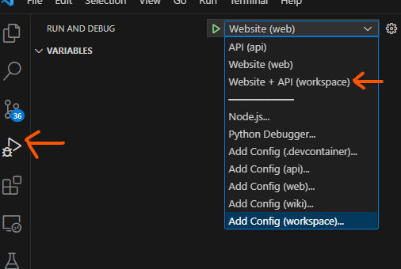

# Overview
Application to fetch relevant investor and investor commitment data from Preqin APIs and display it on a SPA web app, following instructions in the [Preqin Take home task PDF document](./wiki/docs/Technical%20interview%20instructions%20and%20format.pdf)

The front-end is setup using Vite (Vue.js + TypeScript) and the backend is set up using FastAPI to fetch Preqin investor data and send it back to the front-end. 

The development environment is contained using Docker. Follow instructions below to set up and run the project locally.

# Setting up the project locally

## Setting up the Preqin APIs locally
- Clone the repository https://github.com/JayGadi/preqin-technical-test locally 
- Follow instructions in the README to stand up the Preqin API server locally

## Setting up the containerised development environment.
- Install Docker and VSCode and clone this project locally.
- Add extension DevContainers to your VSCode.
- From the project repo, open the **workspace.code-workspace** file with VSCode.
- VSCode should prompt you to open the repository within a container. Do this.
    - If it doesn't, press `F1`, look for **Dev Containers: Open Workspace in Container...** and select the **workspace.code-workspace** file.
    - See the [VSCode DevContainers docs](https://code.visualstudio.com/docs/devcontainers/containers#_quick-start-open-an-existing-folder-in-a-container) for more info on DevContainers if unfamiliar with them.
- VSCode should successfully build the required containers for the project, setting up relevant virtual environments in the projecss.

> NOTE: To connect to the Preqin APIs, the development container is mounted on the default docker network 'bridge' which should be the same network as the local APIs. To connect to the Preqin APIs locally, the Preqin Docker container's IPv4 address was used as requests were failing with http://localhost:8000 for some reason, even though the docs were accessible OK. Something to look into.

## Setting up the website locally
- Once in the docker container **preqinapp.dev** within VS Code, open a bash terminal and navigate to the **web** folder.
- Run `npm install` to install all the packages required by the project, based on the `package.json` file in the folder.

## Setting up the API locally
- All setup steps should have been done by the dockerfile during the build.

## Running the project locally
In VSCode, navigate to **Run and Debug** and launch the `Website + API (workspace)` launch target. See image below.

The website server should now be running locally on http://localhost:5173/.

The application's API server should now be running locally on http://localhost:5000. You can access the API documentation at http://localhost:5000/docs

> Note: You can also run the Website/API servers individually using their respective launch targets.

# Future TODOs
This is a list of future considerations to improve the application, and deployment considerations.

- Front-end improveemnts/enhancement
    - Tidy up front-end routing. Should only be able to route through to select investor ID enpoints (4 atm)
        - If we don't have firmID data, reroute endpoint to home
    - Tidy up front-end variable appearance
        - eg. capitalize firm types, convert date added into more human-readable format, etc
    - Add front-end functionality/logic tests 
        - Jest, Selenium, Cypress, Vue testing library
    - Convert code from JavaScript to TypeScript to improve robustness and maintainability.

- Back-end improvements
    - Set up OAuth2 token auth using JWT/python-jose/FastAPI (auth endpoints currently don't do anything)
    - Add more tests for API routes and methods within the API folder
    - Set up linting (have already done type-checking and code formatting)
        - More tricky because of linters like pylint are very opinionated and offer lots of false positives.

- Deployment considerations
    - Add CI pipeline to create build artifacts and perform code checks
        - Include type-checking (MyPy), code-formmating (black/autopep8/isort), linting (PyLint)
        - Include automated unit tests (pytest)
    - Add CD pipelines for automated deployment
        - Include integration tests (look into testcontainers), end-to-end tests
        - Deploy Infra as Code to version control & improve deployment ease and consistency (Azure Bicep, Terraforn, etc)
    - Add automated monitoring for observability
        - Logging, metrics, dashboards and alerts, both on application logic and on infrastructure resources

- Documentation 
    - Maintain version-controlled wikis, architecture diagrams, etc
    - Document styling conventions, CI/CD processes, release process, etc.

